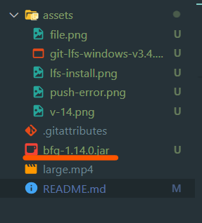

# 100MB이상의 파일 올리기

[참조](https://medium.com/@stargt/github%EC%97%90-100mb-%EC%9D%B4%EC%83%81%EC%9D%98-%ED%8C%8C%EC%9D%BC%EC%9D%84-%EC%98%AC%EB%A6%AC%EB%8A%94-%EB%B0%A9%EB%B2%95-9d9e6e3b94ef)

[GitHub Docs 대용량 파일 정보](https://help.github.com/articles/conditions-for-large-files/) 

100MB보다 큰 크기의 파일을 push하려고 시도하면 아래와 같은 에러메시지를 보게된다


```bash
$ git push -u origin main
Enumerating objects: 7, done.
Counting objects: 100% (7/7), done.
Delta compression using up to 12 threads
Compressing objects: 100% (7/7), done.
Writing objects: 100% (7/7), 68.13 MiB | 9.34 MiB/s, done.
Total 7 (delta 0), reused 0 (delta 0), pack-reused 0
remote: error: Trace: db09fccc0ff4eedfdf0c2cc156fb4d60944b03e115161ada0215ffc483ce4840fc483ce4840
remote: error: See https://gh.io/lfs for more information.                  limit of 100.00 MB     
remote: error: File large.mp4 is 284.24 MB; this exceeds GitHub's file sizeile Storage - https://gi limit of 100.00 MB
remote: error: GH001: Large files detected. You may want to try Git Large File Storage - https://git-lfs.github.com.
To https://github.com/jimeal/LargeFileTest.git                             .git'
 ! [remote rejected] main -> main (pre-receive hook declined)
error: failed to push some refs to 'https://github.com/jimeal/LargeFileTest.git'
```

## 해결방법

### **git-lfs**

commit 과정에서 지정한 파일을 작게 조각내주는 Git Extentsion인 [git-lfs Git Large File Storage](https://git-lfs.github.com/)를 로컬에 설치한 뒤 적용하려는 폴더 경로에서 다음 명령을 실행한다

```bash
$ git lfs install
```
    

용량이 큰 파일을 git-lfs 관리대상으로 등록해준다  

```bash
$ git lfs track “*.exe”
```
  

그다음 commit, push를 실행해주면 된다  
그런데 기존에 대용량 파일을 시도한 적이 있다면 여전히 에러메시지를 보게된다  

그럴경우 BFG Repo-Cleaner 적용해야 한다  
기존 Commit에서 100MB보다 큰 파일의 로그를 강제로 없애줘야 한다.  

<br>

### **BFG Repo Cleaner**

[BFG Repo-Cleaner — BFG Repo-Cleaner](https://rtyley.github.io/bfg-repo-cleaner/)   

먼저, 다운로드를 받고 해당 파일을 대상이 되는 폴더로 이동시킨다    

  


아래 명령어를 실행한다  
```bash
$ java -jar bfg-1.14.0.jar --strip-blobs-bigger-than 100M
```

다음과 같은 오류가 난다면   

   

아래와 같은 명령어를 실행한 후 다시 실행한다  
```bash
$ git repack && git gc
```

<br>

다시 push를 해준다  
```bash
$ git push
```


